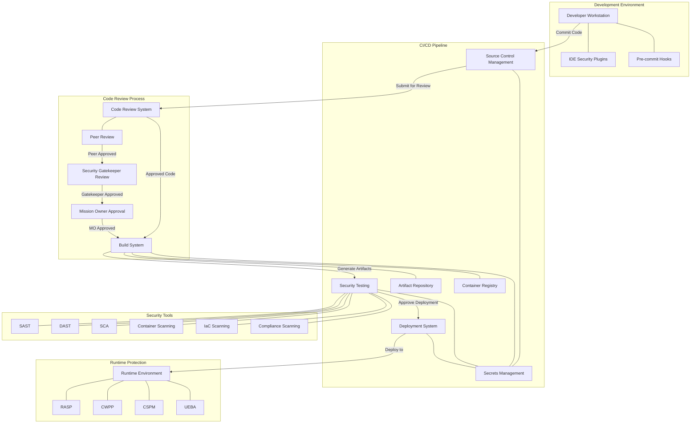

# DoD-Compliant Secure CI/CD Pipeline Implementation

This document outlines a secure CI/CD pipeline implementation based on the requirements and recommendations in the DoD Cloud Security Playbook Volumes 1 and 2. The implementation follows DoD security standards while enabling efficient software delivery.

## Table of Contents

1. [Pipeline Architecture Overview](#1-pipeline-architecture-overview)
2. [Implementation Process](#2-implementation-process)
3. [Security Components](#3-security-components)
4. [Compliance and Monitoring](#4-compliance-and-monitoring)
5. [Conclusion](#5-conclusion)
6. [Acronym Table](#6-acronym-table)

## 1. Pipeline Architecture Overview



### 1.1 Pipeline Stages

The DoD-compliant CI/CD pipeline consists of the following sequential stages:

1. **Code Development**
   - Developers write code following secure coding practices
   - Security-focused IDE plugins scan code during development
   - Pre-commit hooks validate code before submission
   - Code is signed using developer certificates

2. **Source Control Management**
   - Code is submitted to a secure repository
   - Access controls enforce least privilege principles
   - Branch protection prevents unauthorized modifications
   - Automated secret detection prevents credential exposure
   - All commits are signed and verified

3. **Code Review Process**
   - Multi-tier review process begins with peer review
   - Security gatekeepers verify security requirements
   - Mission Owner provides final authorization
   - Approval metadata is recorded for audit purposes

4. **Build**
   - Code is compiled in secure build environments
   - Build artifacts are validated for integrity
   - Container images are created with secure configurations
   - All build artifacts are signed and verified

5. **Security Testing**
   - Static application security testing identifies code vulnerabilities
   - Dynamic application security testing validates runtime behavior
   - Infrastructure code is scanned for misconfigurations
   - Dependencies are analyzed for known vulnerabilities
   - Container images are scanned for security issues

6. **Deployment**
   - Infrastructure is validated before deployment
   - Configurations are scanned for security issues
   - Immutable infrastructure patterns are enforced
   - Blue-green deployment enables safe rollouts

7. **Runtime Protection**
   - Continuous monitoring identifies abnormal behavior
   - Runtime application self-protection prevents attacks
   - Ongoing vulnerability scanning identifies new issues
   - Behavioral analysis detects anomalous activity

**For detailed implementation of each stage, see:**
- [Code Development Security Details](dod-secure-cicd-code-development)
- [Source Control Security Details](dod-secure-cicd-source-control)
- [Build Security Details](dod-secure-cicd-build-security)
- [Security Testing Details](dod-secure-cicd-security-testing)
- [Deployment Security Details](dod-secure-cicd-deployment)
- [Runtime Protection Details](dod-secure-cicd-runtime-protection)

## 2. Implementation Process

The implementation of a DoD-compliant CI/CD pipeline follows a phased approach:

### 2.1 Phase 1: Foundation (0-3 months)

1. **Pipeline Structure**
   - Set up basic CI/CD pipeline
   - Implement code repository security
   - Deploy initial security gates
   - Establish artifact management

2. **Security Scanning**
   - Deploy SAST tools
   - Implement dependency scanning
   - Set up container scanning
   - Configure IaC scanning

3. **Security Gates**
   - Define security quality gates
   - Implement vulnerability blocking
   - Establish peer review process
   - Create basic security metrics

4. **Secrets Management**
   - Deploy secrets vault
   - Implement secure injection
   - Configure secret scanning
   - Establish rotation processes

5. **Compliance Checks**
   - Define baseline compliance requirements
   - Implement basic compliance scanning
   - Create compliance reporting
   - Establish remediation processes

### 2.2 Phase 2: Enhancement (3-6 months)

1. **Zero Trust Architecture**
   - Implement identity-based access
   - Deploy micro-segmentation
   - Establish continuous validation
   - Enable just-in-time access

2. **Container Security**
   - Enhance container scanning
   - Implement runtime protection
   - Deploy admission controllers
   - Establish image signing

3. **Advanced Secret Management**
   - Implement dynamic secrets
   - Deploy secret rotation
   - Enable audit logging
   - Establish secret governance

4. **Enhanced Security Testing**
   - Deploy DAST scanning
   - Implement IAST capabilities
   - Enhance API security testing
   - Establish security unit testing

5. **Compliance Automation**
   - Enhance compliance scanning
   - Implement evidence collection
   - Deploy compliance dashboards
   - Establish remediation automation

### 2.3 Phase 3: Optimization (6-12 months)

1. **Continuous Security Validation**
   - Implement security chaos engineering
   - Deploy adversary emulation
   - Establish purple team exercises
   - Create validation metrics

2. **Advanced Threat Detection**
   - Deploy behavior analytics
   - Implement threat intelligence
   - Enhance anomaly detection
   - Establish threat hunting

3. **Cloud Security Integration**
   - Enhance cloud security posture
   - Deploy workload protection
   - Implement entitlement management
   - Establish cross-cloud security

4. **Advanced Monitoring**
   - Implement security observability
   - Deploy advanced analytics
   - Enhance alerting capabilities
   - Establish executive reporting

5. **Security Chaos Engineering**
   - Implement fault injection
   - Deploy control degradation testing
   - Establish resilience validation
   - Create recovery verification

**For detailed implementation roadmap:**
- [Complete Implementation Roadmap](dod-secure-cicd-implementation-roadmap)

## 3. Security Components

### 3.1 Multi-Tier Code Review Process

A critical component of DoD-compliant CI/CD pipelines is a robust code review process that follows a hierarchical approval workflow.

```
┌────────────────────────────────────────────────────────────────┐
│                                                                │
│                      Code Submission                           │
│                                                                │
└────────────────────────────────┬───────────────────────────────┘
                                 │
                                 ▼
┌────────────────────────────────────────────────────────────────┐
│                                                                │
│                      Peer Review                               │
│                                                                │
│  • Technical accuracy review by fellow developers              │
│  • Adherence to coding standards                               │
│  • Initial security review                                     │
│  • Functional testing verification                             │
│                                                                │
└────────────────────────────────┬───────────────────────────────┘
                                 │
                                 ▼
┌────────────────────────────────────────────────────────────────┐
│                                                                │
│                 Security Gatekeeper Review                     │
│                                                                │
│  • Comprehensive security analysis                             │
│  • Verification of security control implementation             │
│  • Compliance with DoD security requirements                   │
│  • Review of SAST/SCA findings and remediation                 │
│                                                                │
└────────────────────────────────┬───────────────────────────────┘
                                 │
                                 ▼
┌────────────────────────────────────────────────────────────────┐
│                                                                │
│                   Mission Owner Approval                       │
│                                                                │
│  • Final authorization for production deployment               │
│  • Alignment with mission requirements                         │
│  • Risk acceptance (if applicable)                             │
│  • Authorization to proceed                                    │
│                                                                │
└────────────────────────────────┬───────────────────────────────┘
                                 │
                                 ▼
┌────────────────────────────────────────────────────────────────┐
│                                                                │
│                      Pipeline Execution                        │
│                                                                │
└────────────────────────────────────────────────────────────────┘
```

**For detailed implementation of the code review process:**
- [Multi-Tier Code Review Process Details](dod-secure-cicd-code-review)

### 3.2 Zero Trust Authentication and Authorization

```
┌───────────────────────────────────────────────┐
│                                               │
│      DoD-Approved Identity Provider           │
│      (e.g., CAC, PIV integration)             │
│                                               │
└───────────────┬───────────────────────────────┘
                │
                ▼
┌───────────────────────────────────────────────┐
│                                               │
│      Federated Identity Management            │
│      - MFA enforcement                        │
│      - RBAC policies                          │
│      - Just-in-time access                    │
│                                               │
└───────────────┬───────────────────────────────┘
                │
                ▼
┌───────────────────────────────────────────────┐
│                                               │
│      Pipeline Authentication                  │
│      - Per-stage validation                   │
│      - Continuous authentication              │
│      - Privileged access management           │
│                                               │
└───────────────────────────────────────────────┘
```

**For detailed implementation of Zero Trust:**
- [Zero Trust Implementation Details](dod-secure-cicd-zero-trust)

### 3.3 Secrets Management

```
┌───────────────────────────┐
│                           │
│   Secrets Management      │
│   Vault                   │
│                           │
└─────────────┬─────────────┘
              │
              │
┌─────────────▼─────────────┐      ┌─────────────────────────┐
│                           │      │                         │
│   Secrets Rotation        │      │  Access Control         │
│   Service                 │      │  Service                │
│                           │      │                         │
└─────────────┬─────────────┘      └───────────┬─────────────┘
              │                                │
              │                                │
              ▼                                ▼
┌────────────────────────────────────────────────────────────┐
│                                                            │
│                    Pipeline Components                     │
│                                                            │
└────────────────────────────────────────────────────────────┘
```

**For detailed implementation of Secrets Management:**
- [Secrets Management Implementation Details](dod-secure-cicd-secrets-management)

### 3.4 Container Security

```
┌───────────────────┐     ┌───────────────────┐     ┌───────────────────┐
│                   │     │                   │     │                   │
│ Base Image        │────►│ Dependency        │────►│ Configuration     │
│ Scanning          │     │ Scanning          │     │ Hardening         │
│                   │     │                   │     │                   │
└───────────┬───────┘     └───────────────────┘     └────────┬──────────┘
            │                                                 │
            │             ┌───────────────────┐              │
            │             │                   │              │
            └────────────►│ Vulnerability     │◄─────────────┘
                          │ Remediation       │
                          │                   │
                          └────────┬──────────┘
                                   │
                                   ▼
                          ┌───────────────────┐
                          │                   │
                          │ Signed Container  │
                          │ Image             │
                          │                   │
                          └───────────────────┘
```

**For detailed implementation of Container Security:**
- [Container Security Implementation Details](dod-secure-cicd-container-security)

### 3.5 Infrastructure as Code (IaC) Security

**For detailed implementation of IaC Security:**
- [IaC Security Implementation Details](dod-secure-cicd-iac-security)

### 3.6 Security Testing Framework

```
┌────────────────────┐    ┌────────────────────┐    ┌────────────────────┐
│                    │    │                    │    │                    │
│ Static Analysis    │    │ Dynamic Analysis   │    │ Interactive        │
│ (SAST)             │    │ (DAST)             │    │ Application        │
│ - Code review      │    │ - Endpoint testing │    │ Security Testing   │
│ - Secure coding    │    │ - Authentication   │    │ - Manual testing   │
│ - Vulnerability    │    │ - Session mgmt     │    │ - Edge cases       │
│   detection        │    │ - Input validation │    │ - Business logic   │
│                    │    │                    │    │                    │
└────────┬───────────┘    └────────┬───────────┘    └────────┬───────────┘
         │                         │                         │
         │                         │                         │
         ▼                         ▼                         ▼
┌─────────────────────────────────────────────────────────────────────────┐
│                                                                         │
│                       Security Findings Database                        │
│                                                                         │
└────────────────────────────────────┬────────────────────────────────────┘
                                     │
                                     ▼
┌─────────────────────────────────────────────────────────────────────────┐
│                                                                         │
│                       Risk Assessment & Remediation                     │
│                                                                         │
└─────────────────────────────────────────────────────────────────────────┘
```

**For detailed implementation of Security Testing:**
- [Security Testing Implementation Details](dod-secure-cicd-security-testing)

## 4. Compliance and Monitoring

### 4.1 Cloud Security Controls

```
┌───────────────────────────────────────────────────────────────────┐
│                                                                   │
│                   Cloud Security Posture Management               │
│                                                                   │
└───────────────────────────────┬───────────────────────────────────┘
                                │
                                ▼
┌───────────────────────────────────────────────────────────────────┐
│                                                                   │
│                   Cloud Infrastructure Monitoring                 │
│                                                                   │
└───────────────────────────────┬───────────────────────────────────┘
                                │
                                ▼
┌───────────────────────────────────────────────────────────────────┐
│                                                                   │
│                   Cloud Workload Protection                       │
│                                                                   │
└───────────────────────────────┬───────────────────────────────────┘
                                │
                                ▼
┌───────────────────────────────────────────────────────────────────┐
│                                                                   │
│                   Cloud Infrastructure Entitlement Management     │
│                                                                   │
└───────────────────────────────────────────────────────────────────┘
```

**For detailed implementation of Compliance and Monitoring:**
- [Compliance and Monitoring Implementation Details](dod-secure-cicd-compliance-monitoring)

### 4.2 Continuous Security Validation

**For detailed implementation of Continuous Security Validation:**
- [Continuous Security Validation Details](dod-secure-cicd-continuous-validation)

## 5. Conclusion

This secure CI/CD pipeline implementation aligns with the DoD Cloud Security Playbook requirements by incorporating:

1. **Zero Trust principles** with continuous validation at every stage
2. **Multi-tier code review process** with peer, security gatekeeper, and Mission Owner approval stages
3. **Comprehensive security testing** throughout the pipeline
4. **Container and microservices security** with defense in depth
5. **Infrastructure as Code security** with policy enforcement
6. **Compliance automation** with continuous validation
7. **Secrets management** with dynamic, short-lived credentials
8. **Cloud security integration** with defense in depth

By implementing this pipeline, organizations can ensure their software delivery process meets DoD security requirements while enabling efficient development and deployment processes. The phased approach allows organizations to establish a secure foundation and progressively enhance security capabilities over time.

**For complete implementation examples:**
- [CI/CD Pipeline Implementation Example](dod-secure-cicd-pipeline-example)

## 6. Acronym Table

| Acronym | Definition |
|---------|------------|
| ATO | Authority to Operate |
| AWS | Amazon Web Services |
| CAC | Common Access Card |
| CASB | Cloud Access Security Broker |
| CI/CD | Continuous Integration/Continuous Deployment |
| CIEM | Cloud Infrastructure Entitlement Management |
| CIS | Center for Internet Security |
| CNAPP | Cloud-Native Application Protection Platform |
| CSP | Cloud Service Provider |
| CSPM | Cloud Security Posture Management |
| CWPP | Cloud Workload Protection Platform |
| DAST | Dynamic Application Security Testing |
| DevSecOps | Development, Security, and Operations |
| DISA | Defense Information Systems Agency |
| DoD | Department of Defense |
| FedRAMP | Federal Risk and Authorization Management Program |
| FIPS | Federal Information Processing Standards |
| FISMA | Federal Information Security Management Act |
| GCP | Google Cloud Platform |
| IaC | Infrastructure as Code |
| IAST | Interactive Application Security Testing |
| ICAM | Identity, Credential, and Access Management |
| IDE | Integrated Development Environment |
| IL | Impact Level |
| MFA | Multi-Factor Authentication |
| MITRE ATT&CK | MITRE Adversarial Tactics, Techniques, and Common Knowledge |
| MO | Mission Owner |
| NIST | National Institute of Standards and Technology |
| OWASP | Open Web Application Security Project |
| OWASP ASVS | OWASP Application Security Verification Standard |
| PIV | Personal Identity Verification |
| RASP | Runtime Application Self-Protection |
| RBAC | Role-Based Access Control |
| SANS | SysAdmin, Audit, Network, Security |
| SAST | Static Application Security Testing |
| SCA | Software Composition Analysis |
| SBOM | Software Bill of Materials |
| SRG | Security Requirements Guide |
| STIG | Security Technical Implementation Guide |
| TLS | Transport Layer Security |
| UEBA | User and Entity Behavior Analytics |
