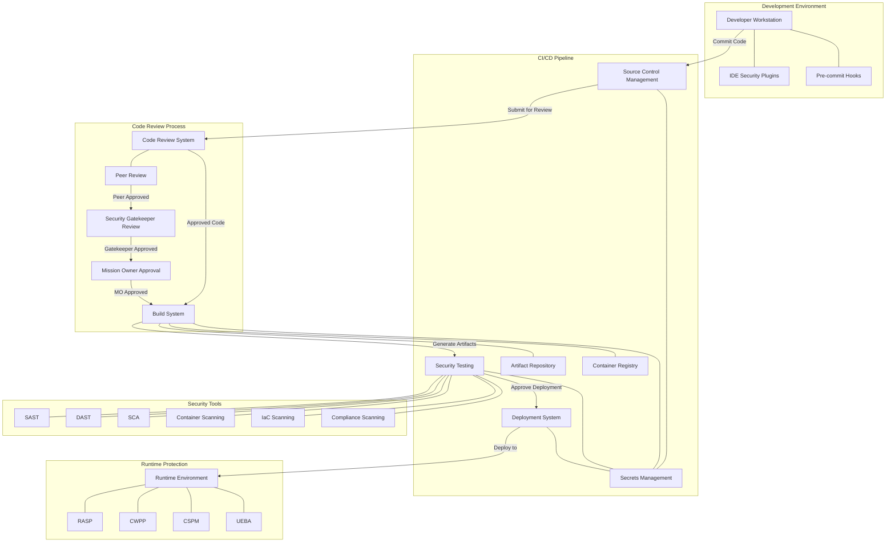

# DoD-Compliant Secure CI/CD Pipeline Implementation

This document outlines a secure CI/CD pipeline implementation based on the requirements and recommendations in the DoD Cloud Security Playbook Volumes 1 and 2. The implementation follows DoD security standards while enabling efficient software delivery.

## 1. Pipeline Architecture Overview



### 1.1 Pipeline Stages

1. **Code Development**
   - Secure coding practices
   - Pre-commit hooks
   - Code signing

2. **Source Control Management**
   - Access control
   - Branch protection
   - Secret detection
   - Signed commits

3. **Code Review Process**
   - Peer review
   - Security gatekeeper review
   - Mission Owner approval

4. **Build**
   - Secure build servers
   - Build artifact validation
   - Container image scanning
   - Software composition analysis

5. **Security Testing**
   - Static application security testing (SAST)
   - Dynamic application security testing (DAST)
   - Infrastructure as Code (IaC) scanning
   - Software composition analysis (SCA)
   - Container scanning

6. **Deployment**
   - Infrastructure validation
   - Configuration scanning
   - Immutable infrastructure
   - Blue-green deployments

7. **Runtime Protection**
   - Continuous monitoring
   - Runtime application self-protection
   - Vulnerability scanning
   - Behavioral analysis

## 2. Zero Trust Implementation in CI/CD

### 2.1 Authentication and Authorization

```
┌───────────────────────────────────────────────┐
│                                               │
│      DoD-Approved Identity Provider           │
│      (e.g., CAC, PIV integration)             │
│                                               │
└───────────────┬───────────────────────────────┘
                │
                ▼
┌───────────────────────────────────────────────┐
│                                               │
│      Federated Identity Management            │
│      - MFA enforcement                        │
│      - RBAC policies                          │
│      - Just-in-time access                    │
│                                               │
└───────────────┬───────────────────────────────┘
                │
                ▼
┌───────────────────────────────────────────────┐
│                                               │
│      Pipeline Authentication                  │
│      - Per-stage validation                   │
│      - Continuous authentication              │
│      - Privileged access management           │
│                                               │
└───────────────────────────────────────────────┘
```

### 2.2 Zero Trust Security Controls

- Implement FIPS 140-2 approved encryption algorithms for all data in transit and at rest
- Apply least privilege access to all pipeline components
- Implement micro-segmentation for pipeline components
- Use short-lived credentials for service accounts
- Implement continuous validation at each pipeline stage
- Enforce code signing for all artifacts
- Apply runtime application self-protection (RASP)

### 2.3 Multi-Tier Code Review Process

A critical component of DoD-compliant CI/CD pipelines is a robust code review process that follows a hierarchical approval workflow. This ensures code meets both functional requirements and security standards before proceeding to build and deployment stages.

#### 2.3.1 Three-Tier Review Framework

```
┌────────────────────────────────────────────────────────────────┐
│                                                                │
│                      Code Submission                           │
│                                                                │
└────────────────────────────────┬───────────────────────────────┘
                                 │
                                 ▼
┌────────────────────────────────────────────────────────────────┐
│                                                                │
│                      Peer Review                               │
│                                                                │
│  • Technical accuracy review by fellow developers              │
│  • Adherence to coding standards                               │
│  • Initial security review                                     │
│  • Functional testing verification                             │
│                                                                │
└────────────────────────────────┬───────────────────────────────┘
                                 │
                                 ▼
┌────────────────────────────────────────────────────────────────┐
│                                                                │
│                 Security Gatekeeper Review                     │
│                                                                │
│  • Comprehensive security analysis                             │
│  • Verification of security control implementation             │
│  • Compliance with DoD security requirements                   │
│  • Review of SAST/SCA findings and remediation                 │
│                                                                │
└────────────────────────────────┬───────────────────────────────┘
                                 │
                                 ▼
┌────────────────────────────────────────────────────────────────┐
│                                                                │
│                   Mission Owner Approval                       │
│                                                                │
│  • Final authorization for production deployment               │
│  • Alignment with mission requirements                         │
│  • Risk acceptance (if applicable)                             │
│  • Authorization to proceed                                    │
│                                                                │
└────────────────────────────────┬───────────────────────────────┘
                                 │
                                 ▼
┌────────────────────────────────────────────────────────────────┐
│                                                                │
│                      Pipeline Execution                        │
│                                                                │
└────────────────────────────────────────────────────────────────┘
```

#### 2.3.2 Review Process Implementation

Each tier of the review process has specific responsibilities and requirements:

1. **Peer Review**
   - Conducted by fellow developers with relevant technical expertise
   - Focus on code quality, readability, and functional correctness
   - Preliminary security review using automated tools and checklists
   - Documentation of findings and recommendations
   - Must achieve consensus approval before proceeding

2. **Security Gatekeeper Review**
   - Performed by designated security personnel with specialized expertise
   - In-depth analysis of security implications
   - Verification that DoD security requirements are implemented correctly
   - Assessment of SAST/DAST/SCA scan results
   - Validation that all critical and high vulnerabilities are addressed
   - Authorization to proceed to Mission Owner review

3. **Mission Owner Approval**
   - Final review by authorized Mission Owner representative
   - Assessment of overall security posture and risk profile
   - Verification that the implementation meets mission requirements
   - Formal approval for deployment to production environment
   - Documentation of any accepted risks with appropriate justification

#### 2.3.3 Review Automation and Tooling

The review process incorporates several automated elements:

- Code review platforms with security-focused checklist enforcement
- Automated policy verification for compliance with organizational standards
- Integration with security testing results for consolidated review
- Digital signatures for each approval stage
- Audit logging of all review decisions and comments
- Time-bound review expiration to ensure currency

#### 2.3.4 Emergency Process Considerations

For urgent security patches or critical updates, a modified review process maintains security while enabling rapid response:

- Abbreviated peer review with focus on critical functionality
- Concurrent security gatekeeper review
- Expedited Mission Owner approval path
- Enhanced post-deployment monitoring
- Mandatory follow-up comprehensive review

## 3. Infrastructure as Code (IaC) Security

### 3.1 IaC Security Scanning

```python
# Example pipeline step for IaC scanning
def scan_infrastructure_code():
    # Scan Terraform, CloudFormation, etc.
    run_iac_security_scan(
        scan_tool="checkov",  # DoD-approved IaC scanner
        files_pattern="**/*.tf,**/*.yaml,**/*.json",
        fail_on_severity="HIGH"
    )

    # Additional policy-as-code validation
    validate_against_dod_policies(
        policy_repository="github.com/dod/secure-baseline-policies",
        fail_on_violation=True
    )
```

### 3.2 IaC Security Best Practices

- Use immutable infrastructure patterns
- Implement version control for all infrastructure code
- Enforce peer review for infrastructure changes
- Implement drift detection
- Deploy dedicated security policies for cloud environments
- Scan IaC templates for misconfigurations before deployment
- Validate compliance with DoD STIGs and SRGs

## 4. Container Security

### 4.1 Container Build Process

```
┌───────────────────┐     ┌───────────────────┐     ┌───────────────────┐
│                   │     │                   │     │                   │
│ Base Image        │────►│ Dependency        │────►│ Configuration     │
│ Scanning          │     │ Scanning          │     │ Hardening         │
│                   │     │                   │     │                   │
└───────────┬───────┘     └───────────────────┘     └────────┬──────────┘
            │                                                │
            │             ┌───────────────────┐              │
            │             │                   │              │
            └────────────►│ Vulnerability     │◄─────────────┘
                          │ Remediation       │
                          │                   │
                          └────────┬──────────┘
                                   │
                                   ▼
                          ┌───────────────────┐
                          │                   │
                          │ Signed Container  │
                          │ Image             │
                          │                   │
                          └───────────────────┘
```

### 4.2 Container Security Controls

- Use minimal base images from authorized registries
- Implement container vulnerability scanning
- Apply pod security policies
- Use non-root containers
- Implement read-only file systems where possible
- Apply resource quotas and limits
- Implement network policies
- Use secrets management for sensitive data
- Deploy runtime container security monitoring

## 5. Application Security Testing Integration

### 5.1 Security Testing Framework

```
┌────────────────────┐    ┌────────────────────┐    ┌────────────────────┐
│                    │    │                    │    │                    │
│ Static Analysis    │    │ Dynamic Analysis   │    │ Interactive        │
│ (SAST)             │    │ (DAST)             │    │ Application        │
│ - Code review      │    │ - Endpoint testing │    │ Security Testing   │
│ - Secure coding    │    │ - Authentication   │    │ - Manual testing   │
│ - Vulnerability    │    │ - Session mgmt     │    │ - Edge cases       │
│   detection        │    │ - Input validation │    │ - Business logic   │
│                    │    │                    │    │                    │
└────────┬───────────┘    └────────┬───────────┘    └────────┬───────────┘
         │                         │                         │
         │                         │                         │
         ▼                         ▼                         ▼
┌─────────────────────────────────────────────────────────────────────────┐
│                                                                         │
│                       Security Findings Database                        │
│                                                                         │
└────────────────────────────────────┬────────────────────────────────────┘
                                     │
                                     ▼
┌─────────────────────────────────────────────────────────────────────────┐
│                                                                         │
│                       Risk Assessment & Remediation                     │
│                                                                         │
└─────────────────────────────────────────────────────────────────────────┘
```

### 5.2 Security Testing Implementation

- Implement SAST in IDE and build stages
- Deploy DAST against staging environments
- Perform software composition analysis for dependencies
- Implement container image scanning
- Conduct manual penetration testing for critical systems
- Use threat modeling during design phase
- Maintain a vulnerability management system for tracking and remediation
- Implement security unit tests

## 6. Secrets Management

### 6.1 Secrets Management Architecture

```
┌───────────────────────────┐
│                           │
│   Secrets Management      │
│   Vault                   │
│                           │
└─────────────┬─────────────┘
              │
              │
┌─────────────▼─────────────┐      ┌─────────────────────────┐
│                           │      │                         │
│   Secrets Rotation        │      │  Access Control         │
│   Service                 │      │  Service                │
│                           │      │                         │
└─────────────┬─────────────┘      └───────────┬─────────────┘
              │                                │
              │                                │
┌─────────────▼────────────────────────────────▼─────────────┐
│                                                            │
│                    Pipeline Components                     │
│                                                            │
└────────────────────────────────────────────────────────────┘
```

### 6.2 Secrets Management Best Practices

- Use a DoD-approved secrets management solution
- Implement short-lived credentials (temporary tokens)
- Rotate secrets automatically
- Avoid hardcoding secrets in code or configuration
- Implement just-in-time access for sensitive credentials
- Use encryption for all secrets at rest and in transit
- Maintain audit logs for all secrets access
- Scan for exposed secrets in code repositories
- Implement secure bootstrapping for initial secrets access

## 7. Compliance Monitoring and Reporting

### 7.1 Compliance Frameworks

The CI/CD pipeline should continuously monitor and report on compliance with:

- NIST 800-53 controls
- DoD Cloud Computing SRG
- FedRAMP requirements
- DoD STIGs
- DISA security requirements

### 7.2 Compliance Automation

```python
# Example compliance check script
def verify_compliance():
    # Run compliance scans
    results = run_compliance_scan(
        frameworks=["NIST800-53", "FedRAMP_Moderate", "DoD_SRG"],
        environment="production",
        generate_evidence=True
    )

    # Generate compliance reports
    generate_compliance_reports(
        results=results,
        format="STIG_Viewer_Compatible",
        export_path="/compliance/reports/"
    )

    # Notify on compliance issues
    if results.has_critical_findings():
        notify_security_team(results.critical_findings)
        fail_pipeline()
```

## 8. Pipeline Implementation Example

Below is an example implementation of a secure CI/CD pipeline using Jenkins and various security tools that align with DoD requirements:

```groovy
pipeline {
    agent any

    environment {
        // Use credential store for sensitive variables
        DOCKER_REGISTRY_CREDENTIALS = credentials('docker-registry-credentials')
        ARTIFACT_REPOSITORY_CREDENTIALS = credentials('artifact-repo-credentials')
    }

    stages {
        stage('Code Checkout') {
            steps {
                // Verify code signatures
                sh 'git verify-commit HEAD'

                // Scan for secrets
                sh 'detect-secrets scan'

                // Code checkout with commit signature validation
                checkout([$class: 'GitSCM',
                    branches: [[name: '*/main']],
                    extensions: [[$class: 'CloneOption',
                        noTags: false,
                        shallow: false,
                        depth: 0,
                        reference: '']],
                    userRemoteConfigs: [[
                        url: 'https://github.com/organization/repository.git',
                        refspec: '+refs/heads/main:refs/remotes/origin/main'
                    ]]
                ])
            }
        }

        stage('Peer Review Verification') {
            steps {
                // Verify that peer review has been completed
                script {
                    def peerReviewStatus = sh(script: 'code-review-status-checker --level=peer', returnStdout: true).trim()
                    if (peerReviewStatus != 'APPROVED') {
                        error "Peer review has not been completed or approved"
                    }

                    // Record peer review metadata
                    sh 'record-review-metadata --level=peer --pipeline-run=${BUILD_NUMBER}'
                }
            }
        }

        stage('Security Gatekeeper Review Verification') {
            steps {
                // Verify that security gatekeeper review has been completed
                script {
                    def gatekeeperReviewStatus = sh(script: 'code-review-status-checker --level=security-gatekeeper', returnStdout: true).trim()
                    if (gatekeeperReviewStatus != 'APPROVED') {
                        error "Security Gatekeeper review has not been completed or approved"
                    }

                    // Record gatekeeper review metadata
                    sh 'record-review-metadata --level=security-gatekeeper --pipeline-run=${BUILD_NUMBER}'
                }
            }
        }

        stage('Mission Owner Approval Verification') {
            steps {
                // Verify that Mission Owner approval has been granted
                script {
                    def moApprovalStatus = sh(script: 'code-review-status-checker --level=mission-owner', returnStdout: true).trim()
                    if (moApprovalStatus != 'APPROVED') {
                        error "Mission Owner approval has not been granted"
                    }

                    // Record MO approval metadata
                    sh 'record-review-metadata --level=mission-owner --pipeline-run=${BUILD_NUMBER}'

                    // Generate approval attestation
                    sh 'generate-approval-attestation --signers=${APPROVERS} --commit=${GIT_COMMIT}'
                }
            }
        }

        stage('SAST') {
            steps {
                // Static Application Security Testing
                sh 'sonarqube-scanner'
                sh 'fortify-sca'

                // Software Composition Analysis
                sh 'dependency-check'

                // Evaluate results
                script {
                    def sastResults = readFile('sast-results.json')
                    if (sastResults.contains('"severity": "HIGH"')) {
                        error "Critical security vulnerabilities found in SAST scan"
                    }
                }
            }
        }

        stage('Build') {
            steps {
                // Signed build process
                sh 'mvn clean package -Dgpg.sign=true'

                // Verify build integrity
                sh 'verify-build-signatures'

                // Build container image
                sh 'docker build -t application:${BUILD_NUMBER} .'
            }
        }

        stage('Container Security') {
            steps {
                // Container image scanning
                sh 'trivy image application:${BUILD_NUMBER}'
                sh 'clair-scanner application:${BUILD_NUMBER}'

                // Image hardening verification
                sh 'container-compliance-scanner application:${BUILD_NUMBER}'

                // Evaluate results
                script {
                    def containerScanResults = readFile('container-scan-results.json')
                    if (containerScanResults.contains('"severity": "CRITICAL"')) {
                        error "Critical vulnerabilities found in container"
                    }
                }
            }
        }

        stage('Infrastructure Validation') {
            steps {
                // Infrastructure as Code scanning
                sh 'terraform validate'
                sh 'checkov -d terraform/'
                sh 'cloudsploit scan'

                // Evaluate results
                script {
                    def iacScanResults = readFile('iac-scan-results.json')
                    if (iacScanResults.contains('"severity": "HIGH"')) {
                        error "Critical misconfigurations found in infrastructure code"
                    }
                }
            }
        }

        stage('Deploy to Test') {
            steps {
                // Deploy to isolated test environment
                sh 'terraform apply -auto-approve'

                // Verify deployment
                sh 'deployment-validator'
            }
        }

        stage('DAST') {
            steps {
                // Dynamic Application Security Testing
                sh 'owasp-zap-scan https://test-environment.example.com'
                sh 'burp-suite-enterprise-scan https://test-environment.example.com'

                // Evaluate results
                script {
                    def dastResults = readFile('dast-results.json')
                    if (dastResults.contains('"severity": "HIGH"')) {
                        error "Critical security vulnerabilities found in DAST scan"
                    }
                }
            }
        }

        stage('Security Compliance') {
            steps {
                // Compliance validation
                sh 'compliance-validator --framework=DoD-SRG --level=IL4'

                // STIG verification
                sh 'stig-checker'

                // Evaluate results
                script {
                    def complianceResults = readFile('compliance-results.json')
                    if (complianceResults.contains('"status": "FAIL"')) {
                        error "Compliance requirements not met"
                    }
                }
            }
        }

        stage('Security Sign-off') {
            steps {
                // Security review and approval
                timeout(time: 24, unit: 'HOURS') {
                    input message: 'Approve security review?', submitter: 'security-team'
                }
            }
        }

        stage('Production Deployment') {
            steps {
                // Blue-green deployment
                sh 'blue-green-deployer'

                // Verify deployment
                sh 'deployment-health-check'

                // Apply runtime protection
                sh 'runtime-security-enforcer'
            }
        }

        stage('Continuous Monitoring') {
            steps {
                // Enable runtime monitoring
                sh 'enable-runtime-monitoring'

                // Set up logging
                sh 'configure-centralized-logging'

                // Configure alerting
                sh 'setup-security-alerting'
            }
        }
    }

    post {
        always {
            // Archive security artifacts
            archiveArtifacts artifacts: 'security-results/**/*', fingerprint: true

            // Send security report
            emailext body: 'Security scan results attached',
                     subject: 'Pipeline Security Results',
                     to: 'security-team@example.com',
                     attachments: 'security-results/**/*'
        }
    }
}
```

## 9. Continuous Security Validation

### 9.1 Continuous Testing Framework

- Implement regular automated security testing
- Schedule periodic penetration testing
- Conduct security chaos engineering exercises
- Monitor and assess security posture continuously
- Simulate threat scenarios to validate security controls
- Implement secure code review processes
- Regularly validate access controls and permissions

### 9.2 Feedback Loops

Establish feedback loops throughout the pipeline to ensure continuous improvement:

- Developer feedback for security findings
- Operations feedback for runtime issues
- Security team feedback for compliance issues
- Automated reporting on security metrics
- Regular security posture assessments
- Threat intelligence integration

## 10. Cloud Security Integration

### 10.1 Cloud Security Controls

```
┌───────────────────────────────────────────────────────────────────┐
│                                                                   │
│                   Cloud Security Posture Management               │
│                                                                   │
└───────────────────────────────┬───────────────────────────────────┘
                                │
                                ▼
┌───────────────────────────────────────────────────────────────────┐
│                                                                   │
│                   Cloud Infrastructure Monitoring                 │
│                                                                   │
└───────────────────────────────┬───────────────────────────────────┘
                                │
                                ▼
┌───────────────────────────────────────────────────────────────────┐
│                                                                   │
│                   Cloud Workload Protection                       │
│                                                                   │
└───────────────────────────────┬───────────────────────────────────┘
                                │
                                ▼
┌───────────────────────────────────────────────────────────────────┐
│                                                                   │
│                   Cloud Infrastructure Entitlement Management     │
│                                                                   │
└───────────────────────────────────────────────────────────────────┘
```

### 10.2 Cloud-Specific Security Measures

- Implement Cloud Security Posture Management (CSPM)
- Deploy Cloud Workload Protection Platforms (CWPP)
- Utilize Cloud Access Security Brokers (CASB)
- Implement Cloud Infrastructure Entitlement Management (CIEM)
- Enable cloud provider-specific security services
- Implement cloud network security controls
- Apply cloud-specific compliance frameworks
- Enable cloud audit logging and monitoring

## 11. Implementation Roadmap

### 11.1 Phase 1: Foundation

- Implement basic CI/CD pipeline structure
- Deploy core security scanning tools
- Establish security gates for critical vulnerabilities
- Implement basic secrets management
- Deploy initial compliance checks

### 11.2 Phase 2: Enhancement

- Implement Zero Trust architecture
- Deploy container security controls
- Enhance secrets management
- Implement advanced security testing
- Enhance compliance automation

### 11.3 Phase 3: Optimization

- Implement continuous security validation
- Deploy advanced threat detection
- Enhance cloud security integration
- Implement advanced monitoring
- Deploy security chaos engineering

## 12. Conclusion

This secure CI/CD pipeline implementation aligns with the DoD Cloud Security Playbook requirements by incorporating:

- Zero Trust principles with continuous validation
- Multi-tier code review process with peer, security gatekeeper, and Mission Owner approval stages
- Comprehensive security testing throughout the pipeline
- Container and microservices security
- Infrastructure as Code security
- Compliance automation
- Secrets management
- Cloud security integration

By implementing this pipeline, organizations can ensure their software delivery process meets DoD security requirements while enabling efficient development and deployment processes.

## 13. Acronym Table

| Acronym | Definition |
|---------|------------|
| ATO | Authority to Operate |
| AWS | Amazon Web Services |
| CAC | Common Access Card |
| CASB | Cloud Access Security Broker |
| CI/CD | Continuous Integration/Continuous Deployment |
| CIEM | Cloud Infrastructure Entitlement Management |
| CNAPP | Cloud-Native Application Protection Platform |
| CSP | Cloud Service Provider |
| CSPM | Cloud Security Posture Management |
| CWPP | Cloud Workload Protection Platform |
| DAST | Dynamic Application Security Testing |
| DevSecOps | Development, Security, and Operations |
| DISA | Defense Information Systems Agency |
| DoD | Department of Defense |
| FedRAMP | Federal Risk and Authorization Management Program |
| FIPS | Federal Information Processing Standards |
| GCP | Google Cloud Platform |
| IaC | Infrastructure as Code |
| ICAM | Identity, Credential, and Access Management |
| IDE | Integrated Development Environment |
| IL | Impact Level |
| MFA | Multi-Factor Authentication |
| MO | Mission Owner |
| NIST | National Institute of Standards and Technology |
| PIV | Personal Identity Verification |
| RASP | Runtime Application Self-Protection |
| RBAC | Role-Based Access Control |
| SAST | Static Application Security Testing |
| SCA | Software Composition Analysis |
| SRG | Security Requirements Guide |
| STIG | Security Technical Implementation Guide |
| UEBA | User and Entity Behavior Analytics |
